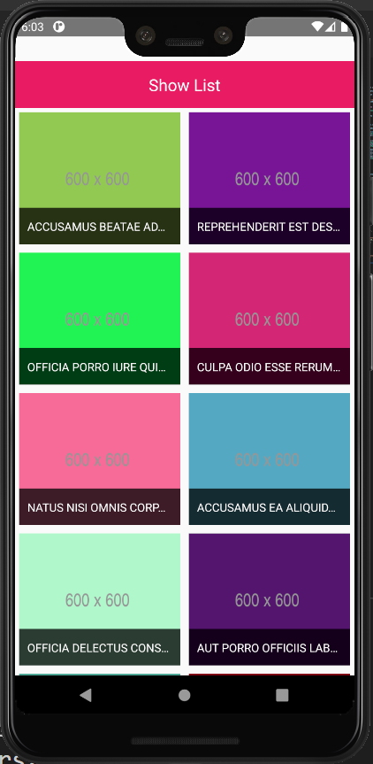
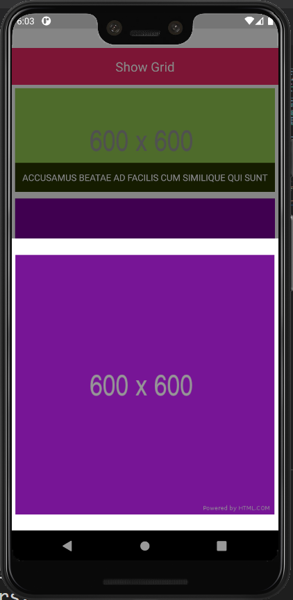

# React-Native Switch View
A react-native app displaying a list of images in list and grid view. App has been implemented using Redux, Thunk and Flatlist.

# Demo

# Packages Used
1. redux
2. thunk
3. middleware
4. axios / fetch etc
5. Flatlist

# Possible Improvements
- Application can persist data in Async storage
- Using should-component-update hook for better performance